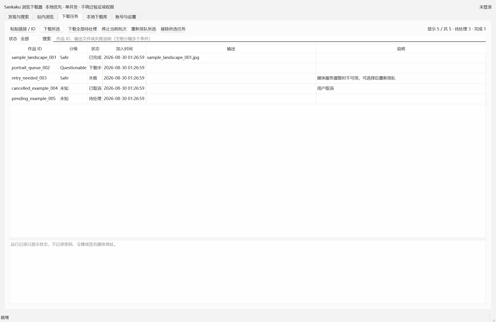

# SankakuSyncer Portable

面向 Windows x64 的 Sankaku Channel 本地浏览与受控下载工具。它借鉴现有便携应用的可迁移启动、严格 URL 边界、DPAPI 本机凭据、可恢复任务篮和 `.part` 原子下载模式，但没有复制任何参考项目的账号、Cookie、缓存、日志或媒体。

系统要求：Windows 10 1903（64 位）或更高版本。该下限来自 WinHTTP 的显式 TLS 降级防护选项；在更旧的 Windows 上程序会失败关闭，不会降低网络安全设置继续运行。

本项目是非官方的独立客户端，与 Sankaku、其运营方及内容权利人不存在隶属、授权、认可或背书关系；项目名称和站点名称仅用于说明兼容对象。

> 只访问和保存你有权使用的内容。项目不会自动处理 CAPTCHA，不会绕过年龄、会员、地域或内容权限，不会轮换身份、代理、User-Agent 或 API 主机。Sankaku 没有为本项目提供或承诺第三方 API；站点行为和许可可能变化，使用前请自行核对 [服务条款](https://legal.sankakucomplex.com/terms-of-service)。



## 0.1.10 功能

逐版变化见 [CHANGELOG.md](CHANGELOG.md)。

当前版本包含：

- API 的可重放 GET 在 JSON 正文传输中断时会按预算重试；失败响应、限流响应和临时服务端错误都会先关闭原生请求与连接，再退避或等待，不会在冷却期间占用句柄。
- 取消搜索时，即使底层关闭表现为静默正文结束或恰逢 JSON 解析失败，也只报告“已取消”且不再请求；所有 POST 在方法层禁止自动重放，密码与变更请求不会因网络故障被重复发送。
- 当前下载批次拥有的任务在线程完全结束前不能从任务篮移除；混合选择会整批拒绝，避免任务记录先消失但媒体仍继续下载。批次外的非活动任务仍可在下载期间单独移除，底层任务存储也会原子拒绝任何包含排队或运行任务的删除请求。
- 下载任务表刷新、状态变化或筛选重排后，会按作品 ID 恢复仍可见的多选行、当前焦点列与顶部视口锚点；已经隐藏或删除的任务不会被错误重新选中，同序状态变化也只更新实际变化行。
- 下载线程在创建、启动或 API/下载器初始化失败时会以明确终态结束；界面只回收该线程拥有的排队/运行任务，迟到信号不能改写新批次，用户停止、站点阻断和恢复写盘失败保持不同提示。
- 确定性 ZIP 序列化边界要求 `Data/`、`Downloads/` 是规范命名的普通空目录，只写两个空目录项且绝不下钻；归档验证期间出现私有内容会在最终发布前失败，不生成含用户数据的归档。
- Windows 发行 runner 即使把同一系统临时目录混用 8.3 短路径与长路径，也会按规范化路径合同完成自检单测；Runtime、codec 和私有数据门禁保持不变。
- 下载任务页支持按作品 ID、输出文件和错误说明进行 256 字符内的多条件搜索，并可与待处理、排队、运行、完成、失败、取消六种状态组合筛选；10,000 项任务使用惰性表格模型，筛选不改变任务顺序和状态。
- “下载全部待处理”始终作用于整个任务篮，不会因当前筛选隐藏任务；选中重试和移除只作用于当前可见选择。
- 断点续传在提交前核对 `.part` 的磁盘实际大小；其他写者并发追加时失败关闭并保留现场，不会把派生 sample/preview 的重复字节误当成完整文件。
- 下载目录设置只接受随便携根移动的 `Downloads` 相对路径或明确的 Windows 绝对路径；盘符相对路径、ADS、设备名、尾随点/空格和目录越界会被拒绝。
- Runtime 验证失败会在本地终端和 CI 显示具体步骤、退出码、stdout/stderr 以及页签 expected/actual；临时验证根位于被审计 Runtime 之外，这些临时文件和诊断都不会写入确定性 report 或发行 ZIP。
- 本地下载库现在能区分“文件不可读”和“路径不安全”：权限拒绝、Windows 共享/文件锁冲突与已打开文件的普通读取故障显示为“无法读取”；链接、重解析点、目录、非普通文件与未知原生错误仍按“路径不安全”失败关闭。
- 所有底层路径、errno 与 NTSTATUS 继续被固定消息脱敏；媒体已完整校验后若元数据复读失败，报告仍保留实际完成校验的字节数。
- “本地下载库”支持按作品 ID、作者、标签和文件名进行多条件搜索，并可按完整性状态、ID、创作时间或文件大小筛选排序。
- 选中已验证的静态 JPEG、PNG 或 WebP 后可离线预览；预览会重新绑定扫描根目录身份、文件大小、SHA-256 和内容类型，不联网，也不会读取报告之外的替换文件。
- 本地预览在交给 Qt 前执行严格容器白名单检查，拒绝内嵌文本、ICC/EXIF/XMP 和动画；输入最大 20 MiB、解码像素最大 1600 万，并从纯像素副本生成缩略图。
- 发布门禁会在只读子进程中实际编解码 PNG、JPEG 和 WebP，缺失便携 Qt 图片插件时直接阻止出包。
- 下载工作线程的所有权与结束清理改为同一实例绑定；上一个线程尚未完全回收时不会启动新的下载线程。
- 本地库仍仅在已保存下载目录第一层做只读离线扫描；一次扫描全程固定同一个根目录句柄，名称、sidecar 与媒体都从该句柄相对打开，再校验 SHA-256、媒体签名和文件身份。取消或失败不会覆盖上次完整报告。
- 持久凭据改为无秘密事务 journal 与 vault receipt 绑定，启用、禁用和崩溃恢复均失败关闭；新会话写入后不会回退激活旧会话。
- 由于 0.1.1 记住状态没有 receipt 绑定，首次升级会安全清除它并要求重新登录一次；密码仍不持久化。

- 原生发现与标签搜索：默认 `rating:safe`，只有用户主动选择时才请求其他分级；每页 8–40 项，游标原样分页。
- 图片网格：缩略图最多双并发、20 MiB 上限、官方 HTTPS 媒体域白名单；双击可在站内页打开。
- 受限站内浏览：只允许 Sankaku 官方 HTTPS 页面，不接受带账号信息或令牌参数的 URL；禁止弹窗和网页直接下载。
- 任务篮：作品 ID 去重、10,000 项硬上限、原子 JSON、revision 防多实例静默覆盖；支持搜索与六状态筛选，异常退出后排队/运行任务恢复为待处理。
- 单实例：同一个便携目录一次只允许运行一个进程，避免任务篮与下载终态被两个窗口竞争写入；不同目录副本彼此独立。
- 登录：用户名和密码只发往 `https://sankakuapi.com/auth/token`；令牌与密码不进入普通设置、日志或命令行。本机保存时仅用 Windows DPAPI CurrentUser 加密用户名和令牌，不持久化密码。
- 受控下载：单并发；下载前重新读取作品以刷新短时签名地址；每次跳转重做官方媒体域校验；支持严格 Range 续传、50 GiB 上限、流式 SHA-256、`fsync` 与 Windows 原子 no-replace 提交；同名文件会安全编号，绝不覆盖既有下载。
- 本地元数据：可选的 `<媒体文件名>.json` 只写作品字段、文件名与 SHA-256，不写密码、令牌、签名媒体 URL 或绝对下载目录。
- 保守失败：API 401 与登录认证失败会停止并提示，普通作品/媒体 403 仅失败该项并继续同批任务；429 遵循 `Retry-After`/`X-RateLimit-Reset`，无信号默认等待 10 分钟；5xx 有界退避；不自动切换旧接口。
- 离线回归与 Windows CI：测试发现前同时阻断原生 WinHTTP 和常用 Python 网络入口，自动测试不接触真实账号。

## 便携版使用

便携目录应包含 `App/`、`Runtime/`、启动脚本，以及本机运行后创建的 `Data/` 和 `Downloads/`。

- `启动Sankaku浏览下载器.bat` / `run.bat`：日常启动。
- `启动_带调试窗口.bat` / `run_debug.bat`：查看启动错误。
- `启动_无控制台黑窗.vbs` / `run_silent.vbs`：隐藏控制台启动。
- `运行自动化测试.bat` / `run_tests.bat`：离线测试。
- `verify_portable.bat`：验证包内 Python、依赖来源、Qt WebEngine、预览图片编解码和目录可写性。

同一便携目录启动第二个实例时会显示提示并退出。不要删除正在运行实例的 `Data/.app.lock`，也不要让多个用户同时从同一个网络共享目录运行程序。

首次运行：

1. 在“账号与设置”选择下载目录。
2. 如需账号内容，在同页输入账号密码并点击“验证并登录”；勾选后仅保存 DPAPI 加密文件。
3. 在“发现与搜索”输入标签，选择结果加入任务篮；也可从受限站内页收集当前可见作品链接。
4. 在“下载任务”中选择单项或顺序下载全部待处理任务。
5. 在“本地下载库”中手动扫描，搜索、筛选、排序并离线预览已验证的静态图片；此页不会联网、删除、修复或自动重下。

默认下载值是相对于当前便携根目录的 `Downloads`，所以整目录搬移后会跟随新位置。用户主动选择的外部目录保存为绝对路径，不会在换盘或换机后自动猜测新位置；搬移后请先检查设置。`Data/.credentials` 受 DPAPI CurrentUser 保护，换 Windows 用户或换机器后需要重新登录。

## 源码开发

项目使用 Python 3.13、PySide6 6.11.2 与 Windows 原生 WinHTTP/Schannel。应用传输不携带 requests、urllib3、PySocks、Python `_ssl` 或 OpenSSL DLL；代理只支持一个不带凭据的显式 HTTP 代理（可为 HTTPS 目标建立 CONNECT），不支持 SOCKS 或 HTTPS-to-proxy。普通开发环境：

```powershell
python -m venv .venv
.\.venv\Scripts\python.exe -m pip install -r App\requirements.lock.txt
.\.venv\Scripts\python.exe App\run_tests.py
.\.venv\Scripts\python.exe App\main.py
```

便携 Runtime 不进入 Git。正式发布只能使用来源、版本、架构、哈希和许可证均有记录的 Python 3.13.15 x64 embeddable/PySide6 6.11.2 Runtime；不能仅因另一个项目能够启动就直接复制其 Runtime。必须重新执行依赖检查、离线测试和只读发布门禁。绝不能从其他项目复制 `Data/`、浏览器 Profile、设置、Cookie、缓存、日志或下载内容。

完整 staging、Runtime 布局、只读 `--release` 门禁、SHA-256 清单与搬移烟测步骤见 [PORTABLE_BUILD.md](PORTABLE_BUILD.md)。普通用户运行 `verify_portable.bat` 会检查目录可写性；发布者应改用：

```bat
verify_portable.bat --release
```

## 目录结构

```text
SankakuSyncer_Portable/
├─ App/                 源码、测试、自检
├─ Data/                本机设置、DPAPI 凭据、任务篮（不提交）
├─ Downloads/           默认下载目录（不提交）
├─ Runtime/             便携 Python/Qt（不提交）
├─ run*.bat / *.vbs
├─ README.md
├─ CHANGELOG.md
├─ SECURITY.md
├─ PORTABLE_BUILD.md
└─ THIRD_PARTY_NOTICES.md
```

## 设计边界

- 当前站点数据适配器基于公开可观察的站点行为，未获得稳定性保证；接口变化时会失败关闭。
- 搜索、元数据和下载均由用户明确操作触发；没有后台监视、定时抓取或无限分页。
- `file_url` 可能过期、为空或受账号等级限制；程序不会用缩略图冒充原图，也不会拼接或猜测 CDN 地址。
- 下载文件的存在不授予复制、转载、训练、商业使用或再分发权利。
- 源码采用 MIT License；第三方 Runtime 组件分别受其自身许可证约束，分发者必须随最终包提供完整许可/notices、版本与哈希记录和 SBOM。摘要见 [THIRD_PARTY_NOTICES.md](THIRD_PARTY_NOTICES.md)。

更多威胁模型和报告方式见 [SECURITY.md](SECURITY.md)。
